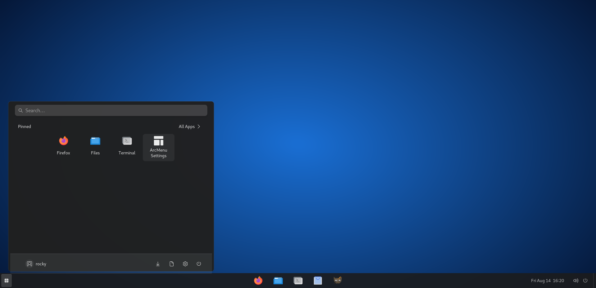

# rocky-docker

Rocky Linux 9 desktop in Docker. Open it in a browser — no VM install needed.



GNOME with a Windows-style taskbar and start menu, plus the usual apps (Firefox, LibreOffice, GIMP, etc.). Works on Mac (Apple Silicon), Linux, and Windows (Docker Desktop).

## Requirements

- Docker + Docker Compose
- ~4 GB free RAM (8 GB is more comfortable)
- Port 6080 free (or whatever you set as `NOVNC_PORT`)
- Linux host recommended for full host-network behaviour; Docker Desktop on Mac/Windows is more limited
- Host Docker socket at `/var/run/docker.sock` (default Docker install)

## Quick start

```bash
cp .env.example .env
docker compose up -d --build
```

First build takes a few minutes. When it's up:

1. Open http://localhost:6080/vnc.html (or `http://host:NOVNC_PORT/vnc.html`)
2. Click **Connect** and enter the VNC password (`changeme` by default)
3. Desktop user is `rocky` — password is whatever you set as `ROCKY_PASSWORD`

These are two different passwords on purpose.

The container uses **host networking**: any port a process opens inside Rocky is
reachable on the host without adding `ports:` entries. It also mounts the host
Docker socket, so `docker` / `docker compose` inside the desktop control the
**host** engine (same containers you see with `docker ps` on the host).

## Config

`.env` controls the basics:

```env
# Linux user rocky (sudo / terminal login)
ROCKY_PASSWORD=changeme

# noVNC prompt when you click Connect
# VNC only carries 8 characters — a longer value is truncated to the first 8
VNC_PASSWORD=changeme

NOVNC_PORT=6080

# host folders mounted into the desktop
ROCKY_HOME=./data/home
SHARED_DIR=./data/shared
DOCUMENTS_DIR=./data/documents
DOWNLOADS_DIR=./data/downloads
```

`NOVNC_PORT` is the port noVNC **binds on the host** (not a Docker publish map).
Do not set it to `5901` — that is TigerVNC display `:1`.

Point `SHARED_DIR` at a real folder if you want host files inside the container:

```env
SHARED_DIR=/Users/you/Projects
```

They show up under `/home/rocky/Shared` (also Documents / Downloads).

## Useful commands

```bash
docker compose logs -f
docker compose down
docker compose up -d
```

## If a password is rejected

`NOVNC_PORT` is the **web** port noVNC listens on. Open it in a browser
(`http://host:PORT/vnc.html`) — pointing a native VNC client at it will not work,
since that port speaks HTTP. With host networking there is no separate “container
port”; the value is the real host bind port.

Check what the container actually applied:

```bash
docker compose logs | grep '\[init\]'
```

A VNC password longer than 8 characters is truncated — the log prints the 8
characters to type. After editing `.env`, recreate the container so it re-reads it:

```bash
docker compose up -d --force-recreate
```

`docker compose restart` does **not** pick up `.env` changes.

If `sudo` in the desktop rejects `ROCKY_PASSWORD`, test it without going through
VNC at all:

```bash
docker compose exec -T rocky-desktop bash -c 'echo "$ROCKY_PASSWORD" | su rocky -c "sudo -S -k id -un"'
```

Printing `root` means the password is correct, and the browser tab is showing a
session from an older container. Compare the hostname in the desktop terminal
prompt with the running container:

```bash
docker compose logs | grep 'container'
docker ps
```

If they differ, hard-reload the browser tab (Ctrl/Cmd+Shift+R) and reconnect.

### Ubuntu hosts: `sudo` rejecting a correct password

Older builds of this image failed every password check on Ubuntu hosts, with the
correct password behaving exactly like a wrong one. Ubuntu ships an AppArmor
profile named `unix-chkpwd`, and AppArmor matches profiles by executable path —
so the container's `/usr/sbin/unix_chkpwd` gets confined by the *host's* profile
even though the container runs unconfined. The profile denies `CAP_DAC_OVERRIDE`,
which Rocky's helper needs to read its mode `000` `/etc/shadow`. On the host:

```bash
sudo dmesg | grep unix-chkpwd
# apparmor="DENIED" ... profile="unix-chkpwd" comm="unix_chkpwd" capname="dac_override"
```

The image now ships `/etc/shadow` as `0640 root:shadow` with a setgid-`shadow`
helper (Ubuntu's own layout), so no capability is needed and hashes stay
unreadable to normal users. Rebuild to pick this up:

```bash
git pull && docker compose up -d --build --force-recreate
```

## Notes

- Needs `--privileged` / host cgroups because GNOME wants systemd-logind. Compose sets that for you.
- Uses `network_mode: host` so desktop-opened ports are on the host without listing them. Avoid binding the same ports as other host services (Coolify, databases, etc.).
- Mounts `/var/run/docker.sock` and ships the Docker CLI. That is full control of the host Docker engine — treat the desktop like a trusted admin session. `rocky` is added to the socket’s group when the socket is group-accessible; otherwise use `sudo docker`.
- Desktop settings you change inside the session are saved to `~/.config/dconf/user`, which lives in `ROCKY_HOME` and survives rebuilds — so it wins over the image defaults in `dconf-windows-look.ini`. To go back to an image default, `dconf reset` that key (e.g. `dconf reset /org/gnome/shell/extensions/dash-to-panel/trans-panel-opacity`).
- Image is architecture-specific. Build on the machine you'll run it on (arm64 vs amd64).
- Video playback covers H.264, AAC, MP3, VP8/VP9, AV1, Opus and Vorbis. H.265/HEVC is not included, since neither Rocky nor EPEL ships a decoder for it — add RPM Fusion yourself if you need it.
- This is Rocky Linux, not RHEL. Same package layout as RHEL 9, no Red Hat subscription required.

## License

MIT
